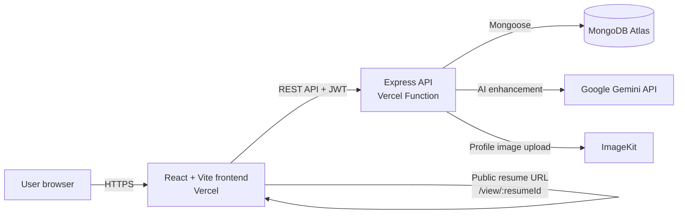

# AI Resume Builder

A full-stack app for creating, editing, enhancing, sharing, and downloading resumes. Users can select a template, use AI to improve summaries and job descriptions, and publish a public resume link.

## Tech stack

| Area | Technology |
| --- | --- |
| Frontend | React 19, Vite, React Router, Redux Toolkit, Tailwind CSS |
| Backend | Node.js, Express 5 |
| Database | MongoDB Atlas with Mongoose |
| Authentication | JWT, bcrypt |
| AI | Gemini through the OpenAI-compatible SDK |
| File handling | Multer and ImageKit |
| Deployment | Vercel (separate frontend and backend projects) |

## System design



### Request flow

1. The React app stores the authenticated user and JWT in Redux/local storage.
2. Requests to protected API routes include the JWT in the `Authorization` header.
3. Express validates the token, reads or updates MongoDB documents, and returns JSON.
4. AI endpoints send only the supplied resume content to Gemini and return enhanced text.
5. Public preview URLs load resumes through `GET /api/resumes/public/:resumeId`; only resumes marked public are returned.

## Key features

- JWT-based registration and login
- Resume creation, editing, deletion, and persistence
- Multiple resume templates and accent-color selection
- AI-enhanced professional summaries and job descriptions
- Resume import from PDF text
- Optional profile-image upload and background removal through ImageKit
- Public resume sharing at `/view/:resumeId`
- Print-friendly resume download

## Local development

Install dependencies and run the frontend and backend in separate terminals:

```bash
cd client
npm install
npm run dev
```

```bash
cd server
npm install
npm run server
```

Create local environment files from the following values.

`client/.env`

```env
VITE_BASE_URL=http://localhost:3000
```

`server/.env`

```env
PORT=3000
MONGODB_URI=your_mongodb_connection_string
JWT_SECRET=your_long_random_secret
IMAGEKIT_PRIVATE_KEY=your_imagekit_private_key
OPENAI_API_KEY=your_gemini_api_key
OPENAI_BASE_URL=https://generativelanguage.googleapis.com/v1beta/openai/
OPENAI_MODEL=gemini-3.6-flash
```

## Deployment

Deploy `client` and `server` as separate Vercel projects.

- In the backend project, configure the server environment variables above.
- In the frontend project, set `VITE_BASE_URL` to the deployed backend URL, for example `https://your-api.vercel.app`.
- Redeploy the frontend after changing `VITE_BASE_URL`, because Vite injects it at build time.
- In MongoDB Atlas, allow the Vercel backend to access the cluster through the IP access list.
